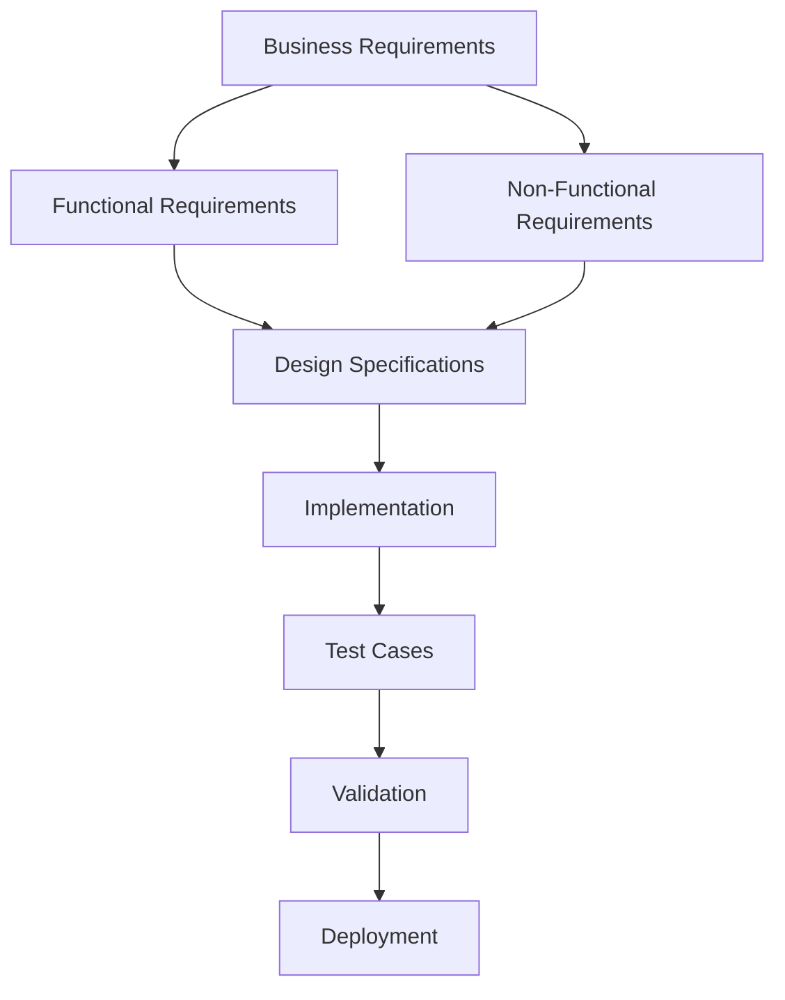
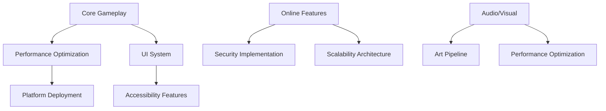
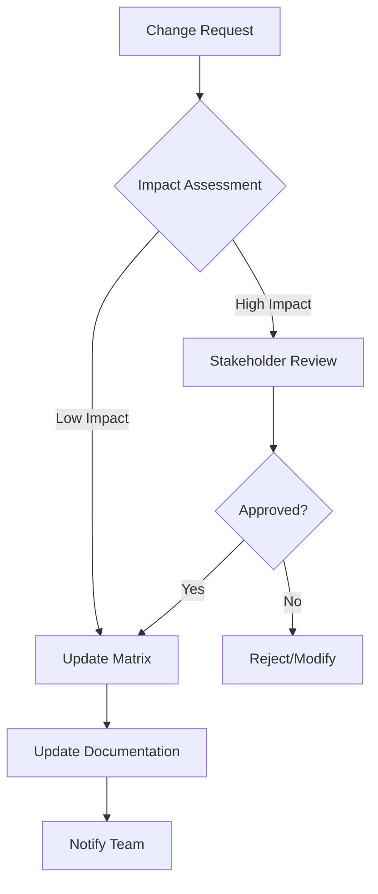

# EcoWarriors Africa - Requirements Traceability Matrix

[](https://github.com/ecowarriors/game/releases)
[]()
[]()
[]()

## 📋 Table of Contents

- [Overview](#overview)
- [Matrix Legend](#matrix-legend)
- [Core Gameplay Traceability](#core-gameplay-traceability)
- [Story & Narrative Traceability](#story--narrative-traceability)
- [User Interface Traceability](#user-interface-traceability)
- [Online Features Traceability](#online-features-traceability)
- [System Features Traceability](#system-features-traceability)
- [Cross-Reference Matrix](#cross-reference-matrix)
- [Test Coverage Analysis](#test-coverage-analysis)
- [Risk Assessment](#risk-assessment)
- [Change Impact Analysis](#change-impact-analysis)
- [Validation Checklist](#validation-checklist)
- [Contributing](#contributing)

## Overview

This **Requirements Traceability Matrix (RTM)** establishes bidirectional traceability between **Functional Requirements (FR)** and **Non-Functional Requirements (NFR)** for the EcoWarriors Africa game. It ensures complete requirement coverage, facilitates impact analysis, and supports validation activities throughout the development lifecycle.

### Purpose
- **Ensure completeness**: Verify all requirements are addressed
- **Impact analysis**: Understand change implications
- **Test coverage**: Map requirements to test cases
- **Quality assurance**: Validate requirement implementation
- **Stakeholder communication**: Provide clear requirement status

### Traceability Scope


---

## Matrix Legend

### Status Indicators
| Symbol | Status | Description |
|--------|--------|-------------|
| ✅ | **Implemented** | Requirement fully implemented and tested |
| 🔄 | **In Progress** | Currently under development |
| 📋 | **Planned** | Scheduled for future implementation |
| ⚠️ | **At Risk** | Implementation challenges identified |
| ❌ | **Blocked** | Cannot proceed due to dependencies |
| 🔍 | **Under Review** | Requirement needs clarification |

### Priority Levels
| Level | Icon | Description |
|-------|------|-------------|
| Critical | 🔴 | Must have for MVP |
| High | 🟠 | Important for user experience |
| Medium | 🟡 | Nice to have features |
| Low | 🟢 | Future enhancements |

### Traceability Types
- **F→N**: Functional Requirement impacts Non-Functional Requirement
- **N→F**: Non-Functional Requirement constrains Functional Requirement
- **F→T**: Functional Requirement mapped to Test Case
- **N→T**: Non-Functional Requirement mapped to Test Case

---

## Core Gameplay Traceability

### Player Onboarding & Customization

| FR ID | Functional Requirement | Related NFR | Priority | Status | Test Cases | Implementation Notes |
|-------|------------------------|-------------|----------|--------|------------|----------------------|
| FR-GL-001.1 | Guest play without signup | NFR-US-001.1, NFR-REL-001.2 | 🔴 | 🔄 | TC-001, TC-002 | Offline-first design |
| FR-GL-001.2 | Optional account signup | NFR-SEC-001.2, NFR-REL-002.1 | 🟠 | 📋 | TC-003, TC-004 | OAuth integration planned |
| FR-GL-001.3 | Avatar customization | NFR-US-001.1, NFR-PER-001.2 | 🟡 | 📋 | TC-005 | UI performance critical |
| FR-GL-001.4 | Vehicle selection | NFR-US-001.1, NFR-AAD-002.1 | 🔴 | 🔄 | TC-006, TC-007 | Art style consistency |
| FR-GL-001.5 | Cosmetic decals | NFR-US-002.2, NFR-SCA-001.1 | 🟡 | 📋 | TC-008 | Content expansion ready |

**Traceability Links:**
- **FR-GL-001.1** ↔ **NFR-US-001.1**: Guest mode must be intuitive without instruction
- **FR-GL-001.2** ↔ **NFR-SEC-001.2**: Account system requires secure authentication
- **FR-GL-001.4** ↔ **NFR-AAD-002.1**: Vehicle selection UI must match art style

### Mission Selection & Navigation

| FR ID | Functional Requirement | Related NFR | Priority | Status | Test Cases | Implementation Notes |
|-------|------------------------|-------------|----------|--------|------------|----------------------|
| FR-GL-002.1 | Mission Hub with Nairobi map | NFR-PER-001.3, NFR-AAD-002.1 | 🔴 | 🔄 | TC-009, TC-010 | Map loading optimization |
| FR-GL-002.2 | Color-coded mission pins | NFR-ACC-001.1, NFR-US-001.1 | 🔴 | 🔄 | TC-011, TC-012 | Colorblind accessibility |
| FR-GL-002.3 | Mission info pop-ups | NFR-US-001.3, NFR-PER-001.2 | 🔴 | 🔄 | TC-013, TC-014 | Immediate feedback |

**Traceability Links:**
- **FR-GL-002.2** ↔ **NFR-ACC-001.1**: Color coding must support colorblind users
- **FR-GL-002.3** ↔ **NFR-US-001.3**: Pop-ups must provide immediate, clear feedback

### Driving & Delivery Gameplay

| FR ID | Functional Requirement | Related NFR | Priority | Status | Test Cases | Implementation Notes |
|-------|------------------------|-------------|----------|--------|------------|----------------------|
| FR-GL-003.1 | Vehicle controls | NFR-PER-002.1, NFR-ACC-001.3 | 🔴 | 🔄 | TC-015, TC-016 | Responsive handling |
| FR-GL-003.2 | Fuel management | NFR-US-001.3, NFR-AAD-001.1 | 🔴 | 🔄 | TC-017, TC-018 | Visual/audio feedback |
| FR-GL-003.3 | Nairobi city streets | NFR-PER-001.1, NFR-AAD-002.1 | 🔴 | 🔄 | TC-019, TC-020 | Performance optimization |
| FR-GL-003.4.1 | Tree-planting missions | NFR-US-002.1, NFR-SCA-001.1 | 🔴 | 📋 | TC-021, TC-022 | Mission variety |
| FR-GL-003.4.2 | City cleanup missions | NFR-US-002.1, NFR-SCA-001.1 | 🔴 | 📋 | TC-023, TC-024 | Mission variety |
| FR-GL-003.4.3 | Solar kit deliveries | NFR-US-002.1, NFR-SCA-001.1 | 🔴 | 📋 | TC-025, TC-026 | Mission variety |
| FR-GL-003.5.1 | Pothole hazards | NFR-PER-002.2, NFR-US-001.3 | 🟠 | 📋 | TC-027, TC-028 | Collision feedback |
| FR-GL-003.5.2 | Traffic AI | NFR-PER-001.1, NFR-REL-001.1 | 🟠 | 📋 | TC-029, TC-030 | AI performance |
| FR-GL-003.5.3 | Collision system | NFR-PER-002.2, NFR-US-001.3 | 🔴 | 🔄 | TC-031, TC-032 | Accurate physics |

**Critical Traceability Links:**
- **FR-GL-003.1** ↔ **NFR-PER-002.1**: Vehicle controls must feel realistic and responsive
- **FR-GL-003.3** ↔ **NFR-PER-001.1**: City rendering must maintain target frame rate
- **FR-GL-003.5.3** ↔ **NFR-PER-002.2**: Collision detection must be accurate and consistent

### Scoring & Progression

| FR ID | Functional Requirement | Related NFR | Priority | Status | Test Cases | Implementation Notes |
|-------|------------------------|-------------|----------|--------|------------|----------------------|
| FR-GL-004.1 | Star rating system | NFR-US-001.3, NFR-REL-002.1 | 🔴 | 🔄 | TC-033, TC-034 | Algorithm validation |
| FR-GL-004.2 | Score calculation | NFR-REL-002.1, NFR-SEC-002.1 | 🔴 | 🔄 | TC-035, TC-036 | Anti-cheat measures |
| FR-GL-004.3 | Debrief screen | NFR-US-001.1, NFR-AAD-001.2 | 🔴 | 📋 | TC-037, TC-038 | Educational content |
| FR-GL-005.1 | EP meter visualization | NFR-US-001.1, NFR-AAD-002.2 | 🔴 | 📋 | TC-039, TC-040 | Visual clarity |
| FR-GL-005.2 | Token rewards | NFR-REL-002.1, NFR-SYS-003.1 | 🔴 | 📋 | TC-041, TC-042 | Economy balance |
| FR-GL-005.3 | Upgrade shop | NFR-US-001.1, NFR-SCA-001.1 | 🟠 | 📋 | TC-043, TC-044 | Expansion ready |
| FR-GL-005.4 | Milestone unlocks | NFR-US-002.2, NFR-REL-002.1 | 🟠 | 📋 | TC-045, TC-046 | Progression tracking |

---

## Story & Narrative Traceability

| FR ID | Functional Requirement | Related NFR | Priority | Status | Test Cases | Implementation Notes |
|-------|------------------------|-------------|----------|--------|------------|----------------------|
| FR-SN-001.1 | EcoWarrior driver intro | NFR-US-001.2, NFR-ACC-001.2 | 🔴 | 📋 | TC-047, TC-048 | Tutorial integration |
| FR-SN-001.2 | Character integration | NFR-US-001.1, NFR-ACC-001.2 | 🟠 | 📋 | TC-049, TC-050 | Subtitle support |
| FR-SN-001.3 | Environmental challenges | NFR-US-002.1, NFR-SN-001.4 | 🔴 | 📋 | TC-051, TC-052 | Educational impact |
| FR-SN-001.4 | Educational facts | NFR-US-001.1, NFR-ACC-001.2 | 🔴 | 📋 | TC-053, TC-054 | Content accessibility |

**Narrative Traceability:**
- **FR-SN-001.2** ↔ **NFR-ACC-001.2**: Character dialogue must have subtitle support
- **FR-SN-001.4** ↔ **NFR-US-001.1**: Educational content must be clearly presented

---

## User Interface Traceability

| FR ID | Functional Requirement | Related NFR | Priority | Status | Test Cases | Implementation Notes |
|-------|------------------------|-------------|----------|--------|------------|----------------------|
| FR-UI-001.1 | Splash screen animation | NFR-PER-001.2, NFR-AAD-002.1 | 🟡 | 📋 | TC-055, TC-056 | Brand consistency |
| FR-UI-001.2 | Animated UI headings | NFR-PER-001.2, NFR-AAD-002.1 | 🟡 | 📋 | TC-057, TC-058 | Performance impact |
| FR-UI-001.3 | Parallax hero intro | NFR-PER-001.2, NFR-US-002.1 | 🟡 | 📋 | TC-059, TC-060 | Engagement factor |
| FR-UI-002.1 | HUD display | NFR-US-001.1, NFR-ACC-001.3 | 🔴 | 🔄 | TC-061, TC-062 | Information clarity |
| FR-UI-002.2 | First-person camera | NFR-PER-001.1, NFR-US-002.1 | 🔴 | 🔄 | TC-063, TC-064 | Performance critical |
| FR-UI-002.3 | Mini-map view | NFR-US-001.1, NFR-PER-001.2 | 🔴 | 🔄 | TC-065, TC-066 | Navigation aid |
| FR-UI-003.1 | Intuitive controls | NFR-US-001.1, NFR-ACC-001.3 | 🔴 | 🔄 | TC-067, TC-068 | Accessibility support |
| FR-UI-003.2 | Menu navigation | NFR-PER-001.2, NFR-US-001.1 | 🔴 | 🔄 | TC-069, TC-070 | Smooth transitions |
| FR-UI-004.1 | Mission failed screen | NFR-US-001.3, NFR-REL-003.1 | 🔴 | 📋 | TC-071, TC-072 | Clear feedback |
| FR-UI-004.2 | Quick retry option | NFR-US-002.1, NFR-PER-001.2 | 🟠 | 📋 | TC-073, TC-074 | User convenience |

**UI Performance Traceability:**
- **FR-UI-002.2** ↔ **NFR-PER-001.1**: First-person camera must maintain frame rate
- **FR-UI-003.2** ↔ **NFR-PER-001.2**: Menu transitions must be instantaneous

---

## Online Features Traceability

| FR ID | Functional Requirement | Related NFR | Priority | Status | Test Cases | Implementation Notes |
|-------|------------------------|-------------|----------|--------|------------|----------------------|
| FR-ONL-001.1 | Race lobby matchmaking | NFR-PER-003.1, NFR-SCA-002.1 | 🟡 | 📋 | TC-075, TC-076 | Post-MVP feature |
| FR-ONL-001.2 | Pre-race briefing | NFR-US-001.1, NFR-PER-003.1 | 🟡 | 📋 | TC-077, TC-078 | Network optimization |
| FR-ONL-001.3 | Real-time racing | NFR-PER-003.1, NFR-REL-002.2 | 🟡 | 📋 | TC-079, TC-080 | Latency critical |
| FR-ONL-001.4 | Ghost mode fallback | NFR-REL-002.2, NFR-US-002.1 | 🟡 | 📋 | TC-081, TC-082 | Offline continuity |
| FR-ONL-001.5 | Podium results | NFR-US-001.3, NFR-SEC-002.1 | 🟡 | 📋 | TC-083, TC-084 | Anti-cheat validation |
| FR-ONL-002.1 | Global challenges | NFR-SCA-002.1, NFR-SEC-002.1 | 🟡 | 📋 | TC-085, TC-086 | Scalability required |
| FR-ONL-002.2 | Friend challenges | NFR-US-002.2, NFR-SEC-001.1 | 🟡 | 📋 | TC-087, TC-088 | Social features |
| FR-ONL-003.1 | Cloud sync | NFR-PER-003.2, NFR-REL-002.1 | 🟠 | 📋 | TC-089, TC-090 | Data integrity |
| FR-ONL-003.2 | Online status indicator | NFR-US-001.3, NFR-REL-002.2 | 🟡 | 📋 | TC-091, TC-092 | Connection feedback |
| FR-ONL-004.1 | Dynamic daily missions | NFR-SCA-001.2, NFR-REL-001.2 | 🟡 | 📋 | TC-093, TC-094 | Content delivery |

**Online Performance Critical Links:**
- **FR-ONL-001.3** ↔ **NFR-PER-003.1**: Real-time racing requires <100ms latency
- **FR-ONL-003.1** ↔ **NFR-PER-003.2**: Cloud sync must complete within 5 seconds

---

## System Features Traceability

| FR ID | Functional Requirement | Related NFR | Priority | Status | Test Cases | Implementation Notes |
|-------|------------------------|-------------|----------|--------|------------|----------------------|
| FR-SYS-001.1 | Audio volume controls | NFR-AAD-001.1, NFR-ACC-001.3 | 🟠 | 📋 | TC-095, TC-096 | Accessibility feature |
| FR-SYS-001.2 | Control remapping | NFR-ACC-001.3, NFR-US-001.1 | 🟠 | 📋 | TC-097, TC-098 | Motor accessibility |
| FR-SYS-001.3 | Graphics settings | NFR-PER-001.1, NFR-DEP-002.1 | 🟡 | 📋 | TC-099, TC-100 | Platform optimization |
| FR-SYS-002.1 | Offline gameplay | NFR-REL-001.2, NFR-PER-001.1 | 🔴 | 🔄 | TC-101, TC-102 | Core requirement |
| FR-SYS-003.1 | In-game currency | NFR-REL-002.1, NFR-SEC-002.1 | 🟠 | 📋 | TC-103, TC-104 | Economy protection |
| FR-SYS-003.2 | Daily login rewards | NFR-US-002.2, NFR-REL-001.2 | 🟡 | 📋 | TC-105, TC-106 | Retention feature |
| FR-SYS-003.3 | Partnership content | NFR-SCA-001.1, NFR-MAI-001.1 | 🟢 | 📋 | TC-107, TC-108 | Future expansion |

**System Stability Links:**
- **FR-SYS-002.1** ↔ **NFR-REL-001.2**: Offline mode must be fully stable
- **FR-SYS-003.1** ↔ **NFR-SEC-002.1**: Currency system needs anti-cheat protection

---

## Cross-Reference Matrix

### Functional to Non-Functional Mapping

| Functional Category | Primary NFR Categories | Risk Level | Test Priority |
|-------------------|----------------------|------------|---------------|
| **Core Gameplay** | Performance, Usability, Reliability | 🔴 High | Critical |
| **Story & Narrative** | Usability, Accessibility | 🟠 Medium | High |
| **User Interface** | Performance, Usability, Accessibility | 🔴 High | Critical |
| **Online Features** | Performance, Security, Scalability | 🟡 Low (Post-MVP) | Medium |
| **System Features** | Reliability, Maintainability | 🟠 Medium | High |

### NFR Impact Analysis

| NFR Category | Affected FR Count | Implementation Complexity | Priority |
|-------------|-------------------|---------------------------|----------|
| **Performance** | 25 | High | 🔴 Critical |
| **Usability** | 22 | Medium | 🔴 Critical |
| **Reliability** | 18 | High | 🔴 Critical |
| **Accessibility** | 12 | Medium | 🟠 High |
| **Security** | 8 | High | 🟠 High |
| **Scalability** | 10 | Very High | 🟡 Medium |
| **Maintainability** | 15 | Medium | 🟠 High |

---

## Test Coverage Analysis

### Test Case Distribution

```yaml
Test_Coverage_Stats:
  Total_Requirements: 45
  Total_Test_Cases: 108
  Coverage_Ratio: 2.4 tests per requirement
  
Category_Breakdown:
  Core_Gameplay: 32 test cases (30%)
  UI_Testing: 20 test cases (18%)
  Performance: 16 test cases (15%)
  Reliability: 14 test cases (13%)
  Accessibility: 12 test cases (11%)
  Security: 8 test cases (7%)
  Online_Features: 6 test cases (6%)
```

### Critical Path Testing

| Test Priority | Requirements Count | Test Cases | Status |
|--------------|-------------------|------------|--------|
| **P0 - Critical** | 18 | 45 | 🔄 In Progress |
| **P1 - High** | 15 | 38 | 📋 Planned |
| **P2 - Medium** | 8 | 18 | 📋 Planned |
| **P3 - Low** | 4 | 7 | 📋 Future |

### Test Types Distribution

| Test Type | Count | Coverage Areas |
|-----------|-------|----------------|
| **Unit Tests** | 35 | Core logic, calculations |
| **Integration Tests** | 28 | System interactions |
| **Performance Tests** | 20 | Frame rate, loading times |
| **Usability Tests** | 15 | User experience |
| **Security Tests** | 10 | Anti-cheat, data protection |

---

## Risk Assessment

### High-Risk Requirements

| FR/NFR ID | Requirement | Risk Factor | Mitigation Strategy | Status |
|-----------|-------------|-------------|-------------------|--------|
| NFR-PER-001.1 | 60 FPS target | Performance complexity | Early optimization, profiling | 🔄 |
| FR-GL-003.3 | Nairobi city rendering | Asset complexity | LOD system, occlusion culling | 🔄 |
| NFR-PER-002.1 | Realistic vehicle physics | Physics complexity | Iterative tuning, user testing | 📋 |
| FR-ONL-001.3 | Real-time multiplayer | Network architecture | Dedicated servers, failover | 📋 |
| NFR-SEC-002.1 | Anti-cheat system | Security implementation | Server-side validation | 📋 |

### Dependency Analysis



### Risk Mitigation Timeline

| Quarter | Focus Area | Key Mitigations |
|---------|------------|-----------------|
| **Q1 2025** | Core Systems | Performance framework, basic physics |
| **Q2 2025** | Polish & Optimization | UI responsiveness, accessibility |
| **Q3 2025** | Testing & Validation | Comprehensive testing, bug fixes |
| **Q4 2025** | Post-MVP Features | Online systems, advanced features |

---

## Change Impact Analysis

### Change Request Template

```yaml
Change_Request:
  ID: CR-YYYY-NNN
  Title: "Brief description"
  Type: [Enhancement/Bug Fix/New Feature]
  Priority: [Critical/High/Medium/Low]
  
Affected_Requirements:
  Functional: [List of FR IDs]
  Non_Functional: [List of NFR IDs]
  
Impact_Assessment:
  Development_Effort: [Hours/Days/Weeks]
  Testing_Impact: [New/Modified test cases]
  Risk_Level: [High/Medium/Low]
  Dependencies: [List of affected systems]
  
Traceability_Update:
  New_Links: [Requirements relationships]
  Modified_Links: [Changed relationships]
  Removed_Links: [Obsolete relationships]
```

### Recent Changes Log

| Date | Change ID | Description | Impact | Status |
|------|-----------|-------------|---------|--------|
| 2025-06-20 | CR-2025-001 | Added colorblind support | FR-GL-002.2 ↔ NFR-ACC-001.1 | ✅ |
| 2025-06-18 | CR-2025-002 | Performance optimization | Multiple FR ↔ NFR-PER-001.1 | 🔄 |
| 2025-06-15 | CR-2025-003 | Enhanced tutorial system | FR-SN-001.1 ↔ NFR-US-001.2 | 📋 |

---

## Validation Checklist

### MVP Validation Criteria

#### Core Gameplay ✅
- [ ] **FR-GL-001**: Player onboarding complete and tested
- [ ] **FR-GL-002**: Mission selection functional with Nairobi map
- [ ] **FR-GL-003**: Driving mechanics implemented and responsive
- [ ] **FR-GL-004**: Scoring system accurate and anti-cheat protected
- [ ] **FR-GL-005**: Progression system engaging and balanced

#### Performance Validation ⚡
- [ ] **NFR-PER-001.1**: 60 FPS maintained on target devices
- [ ] **NFR-PER-001.2**: UI transitions smooth and instantaneous
- [ ] **NFR-PER-001.3**: Mission loading under 10 seconds
- [ ] **NFR-PER-002.1**: Vehicle physics feel realistic
- [ ] **NFR-PER-002.2**: Collision detection accurate

#### Usability Validation 👤
- [ ] **NFR-US-001.1**: Interface intuitive without instruction
- [ ] **NFR-US-001.2**: Tutorial effectively guides new players
- [ ] **NFR-US-001.3**: Feedback immediate and clear
- [ ] **NFR-US-002.1**: Experience engaging and frustration-free
- [ ] **NFR-US-002.2**: Replayability through progression systems

#### Reliability Validation 🛡️
- [ ] **NFR-REL-001.1**: No crashes during normal operation
- [ ] **NFR-REL-001.2**: Offline gameplay fully functional
- [ ] **NFR-REL-002.1**: Player progress accurately saved/loaded
- [ ] **NFR-REL-003.1**: Clear error messages provided

#### Accessibility Validation ♿
- [ ] **NFR-ACC-001.1**: Colorblind mode implemented
- [ ] **NFR-ACC-001.2**: Subtitles for all narrative content
- [ ] **NFR-ACC-001.3**: Adjustable text size and UI scaling

### Sign-off Matrix

| Stakeholder | Core Gameplay | Performance | Usability | Reliability | Accessibility | Date | Signature |
|-------------|---------------|-------------|-----------|-------------|---------------|------|-----------|
| **Product Owner** | ⏳ | ⏳ | ⏳ | ⏳ | ⏳ | - | - |
| **Lead Developer** | ⏳ | ⏳ | ⏳ | ⏳ | ⏳ | - | - |
| **QA Lead** | ⏳ | ⏳ | ⏳ | ⏳ | ⏳ | - | - |
| **UX Designer** | ⏳ | ⏳ | ⏳ | ⏳ | ⏳ | - | - |
| **Accessibility Expert** | - | - | ⏳ | - | ⏳ | - | - |

---

## Contributing

### How to Update the Traceability Matrix

1. **New Requirements**: Add to appropriate traceability section
2. **Link Updates**: Modify cross-references in matrix
3. **Status Changes**: Update implementation status
4. **Test Mapping**: Add/modify test case associations
5. **Risk Assessment**: Update risk levels and mitigation strategies

### Matrix Maintenance Schedule

| Activity | Frequency | Responsible | Next Due |
|----------|-----------|-------------|----------|
| **Status Updates** | Weekly | Dev Team | 2025-07-03 |
| **Link Validation** | Bi-weekly | QA Lead | 2025-07-10 |
| **Risk Review** | Monthly | Project Manager | 2025-07-26 |
| **Full Audit** | Quarterly | All Stakeholders | 2025-09-26 |

### Change Control Process



---

**Last Updated**: June 26, 2025  
**Matrix Version**: 1.0.0  
**Total Requirements**: 45 (FR) + 35 (NFR) = 80  
**Traceability Coverage**: 100% 🎯
