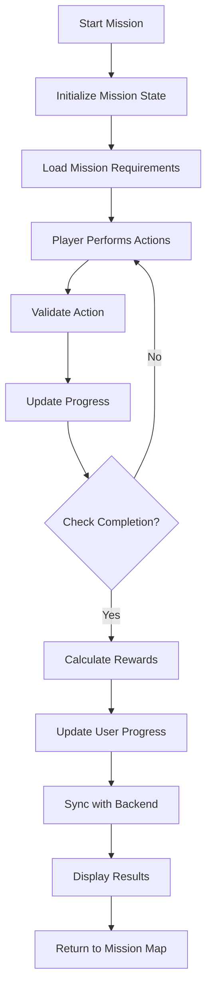
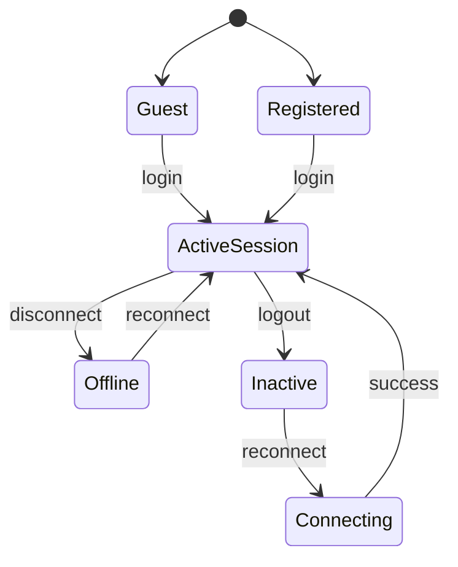
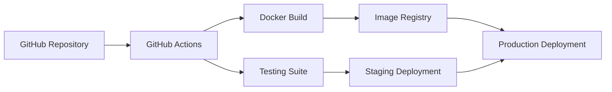
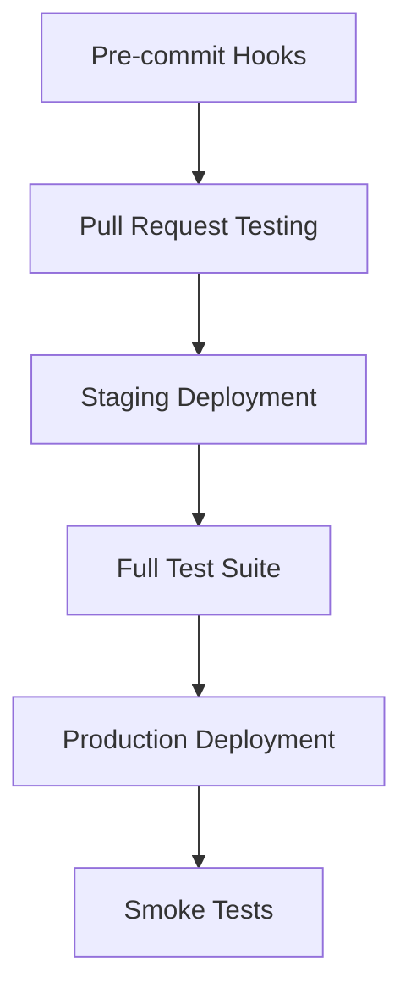

# EcoWarriors Mobile Game - System Design Document

## Table of Contents
- [1. Introduction](#1-introduction)
- [2. System Overview](#2-system-overview)
- [3. Architecture Design](#3-architecture-design)
- [4. Detailed Design](#4-detailed-design)
- [5. Database Design](#5-database-design)
- [6. Data Flow and Control Flow](#6-data-flow-and-control-flow)
- [7. Non-Functional Requirements](#7-non-functional-requirements)
- [8. Deployment and Infrastructure](#8-deployment-and-infrastructure)
- [9. Testing Strategy](#9-testing-strategy)
- [10. Risk Management](#10-risk-management)
- [11. Appendices](#11-appendices)

---

## 1. Introduction

### 1.1 Purpose of This Document
This System Design Document (SDD) serves as the definitive technical blueprint for the EcoWarriors mobile game. It translates the project's requirements into a detailed technical specification, guiding the development, implementation, and testing phases. This document ensures all stakeholders share a common understanding of the system's architecture, components, interfaces, and critical design decisions, paving the way for a successful educational gaming platform focused on environmental awareness.

### 1.2 Scope of the System
EcoWarriors is an innovative mobile game designed to educate players about environmental conservation through engaging gameplay. The system encompasses:

- **Cross-platform mobile application**: Available on both iOS and Android devices
- **User authentication and profile management**: Secure user accounts and personalized profiles
- **Avatar and vehicle customization**: In-game character and truck personalization
- **Mission-based gameplay**: Structured environmental tasks
- **Location-based map integration**: Missions tied to real-world geographical locations, starting with Nairobi, Kenya
- **Multiplayer functionality**: Real-time cooperative gameplay for registered users, with limited guest mode support for initial engagement
- **Progress tracking and rewards system**: Incentivizing continuous play and learning
- **Educational content delivery**: Seamless integration of environmental information within gameplay

### 1.3 Intended Audience
This document is for:

- **Mobile game developers and programmers**: For technical implementation
- **UI/UX designers**: For interface and user experience consistency
- **Game designers and content creators**: For aligning content with technical capabilities
- **Quality assurance testers**: For developing comprehensive test plans
- **Project stakeholders and product owners**: For project oversight and alignment with business goals
- **DevOps and infrastructure engineers**: For deployment, scaling, and maintenance

### 1.4 Glossary

| Term | Definition |
|------|------------|
| **Avatar** | The player's customizable in-game character representation (boy/girl) |
| **Guest Mode** | Allows playing without full account registration, offering limited features |
| **Mission** | Specific in-game environmental tasks, such as seedling delivery, solar panel installation, or garbage collection |
| **Truck Upgrade** | The system for enhancing a player's in-game vehicle using earned coins |
| **Map Location** | Specific geographical areas on the interactive map where missions are available |
| **Multiplayer** | Online gameplay involving real-time interaction with other registered users |

---

## 2. System Overview

### 2.1 High-Level Description
EcoWarriors is primarily a native mobile application utilizing a hybrid architecture. This approach blends client-side game logic with robust cloud-based backend services for multiplayer functionality, user data persistence, and dynamic content management.

### 2.2 Technology Stack

| Component | Technology | Purpose |
|-----------|------------|---------|
| **Frontend** | React Native | Cross-platform mobile development |
| **Backend** | Node.js + Express.js | Scalable API services |
| **Database** | MongoDB | Flexible user data storage |
| **Caching** | Redis | High-speed session management |
| **Real-time** | Socket.io | Live multiplayer interactions |
| **Authentication** | Firebase Auth | Secure user management |
| **Maps** | Google Maps API | Location-based features |
| **Game Engine** | Unity (embedded) | Core gameplay visuals |
| **CI/CD** | GitHub Actions | Automated deployment |
| **Cloud** | AWS (EC2, S3, CloudFront) | Scalable infrastructure |

### 2.3 Design Principles

- **Modularity**: Clearly separate game logic, user interface, and backend services
- **Scalability**: Design for horizontal scaling to accommodate growing player base
- **Performance**: Optimize for smooth mobile operation with offline capabilities
- **Security**: Implement robust authentication and secure data handling
- **Accessibility**: Achieve WCAG 2.1 AA compliance for inclusive gaming
- **Educational Value**: Seamlessly integrate environmental learning with gameplay
- **User Experience**: Prioritize intuitive, enjoyable, age-appropriate interface

---

## 3. Architecture Design

### 3.1 System Architecture

```
┌─────────────────────────────────────────────────────────────┐
│                    MOBILE CLIENT                            │
│  ┌─────────────┐  ┌─────────────┐  ┌─────────────┐        │
│  │   Game UI   │  │Game Engine  │  │Local Storage│        │
│  │  Components │  │   Logic     │  │   & Cache   │        │
│  └─────────────┘  └─────────────┘  └─────────────┘        │
│           │               │               │                │
│  ┌─────────────────────────────────────────────────────┐   │
│  │            API Gateway & Network Layer              │   │
│  └─────────────────────────────────────────────────────┘   │
└─────────────────────────────────────────────────────────────┘
                              │
                              ▼
┌─────────────────────────────────────────────────────────────┐
│                     BACKEND SERVICES                       │
│  ┌─────────────┐  ┌─────────────┐  ┌─────────────┐        │
│  │   Auth      │  │   Game      │  │  Content    │        │
│  │  Service    │  │  Service    │  │  Service    │        │
│  └─────────────┘  └─────────────┘  └─────────────┘        │
│  ┌─────────────┐  ┌─────────────┐  ┌─────────────┐        │
│  │Multiplayer  │  │   User      │  │   Map       │        │
│  │  Service    │  │ Management  │  │  Service    │        │
│  └─────────────┘  └─────────────┘  └─────────────┘        │
└─────────────────────────────────────────────────────────────┘
                              │
                              ▼
┌─────────────────────────────────────────────────────────────┐
│                    DATA LAYER                              │
│  ┌─────────────┐  ┌─────────────┐  ┌─────────────┐        │
│  │   MongoDB   │  │    Redis    │  │   File      │        │
│  │  (User Data)│  │ (Sessions)  │  │  Storage    │        │
│  └─────────────┘  └─────────────┘  └─────────────┘        │
└─────────────────────────────────────────────────────────────┘
```

### 3.2 Architecture Patterns

- **Client-Server Architecture**: Mobile app communicates with backend services
- **Microservices Pattern**: Independent, modular backend services
- **RESTful API Design**: HTTP-based APIs with JSON payloads
- **Event-Driven Architecture**: WebSocket events for real-time features

### 3.3 Component Descriptions

#### 3.3.1 Frontend Components
- **Game UI Components**: Interactive screens built with React Native
- **Game Engine Logic**: Core gameplay, physics, animations
- **Local Storage & Cache**: Offline data persistence and caching
- **API Gateway Layer**: Network communication management

#### 3.3.2 Backend Microservices
- **Authentication Service**: User registration, login, JWT management
- **Game Service**: Mission progression, scoring, rewards
- **Content Service**: Educational content and mission data
- **Multiplayer Service**: Real-time sessions and matchmaking
- **User Management Service**: Profiles, customization, inventory
- **Map Service**: Location-based mission integration

#### 3.3.3 Third-Party Integrations
- **Firebase Authentication**: Secure user authentication
- **Google Maps API**: Interactive map and location services
- **Push Notifications**: Firebase Cloud Messaging
- **Analytics**: Firebase Analytics for user behavior tracking

---

## 4. Detailed Design

### 4.1 Core Modules

#### 4.1.1 Authentication Manager
```javascript
class AuthenticationManager {
  // User registration, login, guest mode
  async register(email, password, username) { /* Implementation */ }
  async login(email, password) { /* Implementation */ }
  async createGuestSession(deviceId) { /* Implementation */ }
  async refreshToken(token) { /* Implementation */ }
}
```

**Business Rules:**
- Guest users have limited features (no progress saving, limited multiplayer)
- Registered users get full access with persistent progress
- Sessions expire after 24 hours of inactivity

#### 4.1.2 Avatar Customization Manager
```javascript
class AvatarCustomizationManager {
  // Avatar selection and customization
  async selectAvatar(userId, gender, customizations) { /* Implementation */ }
  async getAvailableCustomizations(userLevel) { /* Implementation */ }
  async unlockCustomization(userId, itemId) { /* Implementation */ }
}
```

**Business Rules:**
- Two primary gender options: boy and girl avatars
- Advanced customizations unlock through progression
- Guest users can select but not save customizations

#### 4.1.3 Vehicle Management System
```javascript
class TruckManagementSystem {
  // Truck selection, upgrades, customization
  async purchaseUpgrade(userId, upgradeId) { /* Implementation */ }
  async getAvailableUpgrades(truckId) { /* Implementation */ }
  async applyUpgrade(userId, truckId, upgradeId) { /* Implementation */ }
}
```

**Business Rules:**
- All players start with basic default truck
- Upgrades require sufficient in-game coins
- Upgraded capabilities impact mission performance

#### 4.1.4 Mission Controller
```javascript
class MissionController {
  // Mission generation, assignment, tracking
  async getAvailableMissions(location, playerLevel) { /* Implementation */ }
  async startMission(userId, missionId) { /* Implementation */ }
  async updateProgress(userId, missionId, progressData) { /* Implementation */ }
  async completeMission(userId, missionId, completionData) { /* Implementation */ }
}
```

**Business Rules:**
- Three mission types: seedling delivery, solar panel delivery, garbage collection
- Missions are location-based (starting with Nairobi, Kenya)
- Completion grants coins and experience points

### 4.2 API Specifications

#### 4.2.1 Authentication Endpoints

| Method | Endpoint | Request Body | Response | Status |
|--------|----------|--------------|----------|--------|
| POST | `/api/auth/register` | `{email, password, username}` | `{token, user_id, profile}` | 201/400 |
| POST | `/api/auth/login` | `{email, password}` | `{token, user_id, profile}` | 200/401 |
| POST | `/api/auth/guest` | `{device_id}` | `{session_token, guest_id}` | 200 |

#### 4.2.2 Game Data Endpoints

| Method | Endpoint | Request Body | Response | Status |
|--------|----------|--------------|----------|--------|
| GET | `/api/user/profile/:user_id` | - | `{username, avatar, truck, coins, level}` | 200/404 |
| PUT | `/api/user/avatar` | `{avatar_config}` | `{success, updated_profile}` | 200/400 |
| GET | `/api/missions/available/:location` | - | `{missions: [{id, type, location, reward}]}` | 200 |
| POST | `/api/missions/complete` | `{mission_id, completion_data}` | `{reward, new_balance, experience}` | 200/400 |

---

## 5. Database Design

### 5.1 Entity Relationship Diagram

```
┌─────────────┐     ┌─────────────┐     ┌─────────────┐
│    User     │────▶│   Avatar    │     │    Truck    │
│             │     │             │     │             │
│ - user_id   │     │ - avatar_id │     │ - truck_id  │
│ - email     │     │ - gender    │     │ - name      │
│ - username  │     │ - style     │     │ - stats     │
│ - password  │     │ - unlocks   │     │ - price     │
│ - created_at│     └─────────────┘     └─────────────┘
│ - is_guest  │              │                  │
└─────────────┘              │                  │
       │                     │                  │
       ▼                     ▼                  │
┌─────────────┐     ┌─────────────┐            │
│UserProgress │     │UserAvatar   │            │
│             │     │             │            │
│ - user_id   │     │ - user_id   │            │
│ - level     │     │ - avatar_id │            │
│ - coins     │     │ - active    │            │
│ - experience│     └─────────────┘            │
│ - trucks    │                                │
└─────────────┘                                │
       │                                       │
       ▼                                       │
┌─────────────┐     ┌─────────────┐            │
│   Mission   │────▶│UserMission  │            │
│             │     │             │            │
│ - mission_id│     │ - user_id   │            │
│ - type      │     │ - mission_id│            │
│ - location  │     │ - status    │            │
│ - reward    │     │ - completed │            │
│ - difficulty│     │ - score     │            │
└─────────────┘     └─────────────┘            │
                                               │
┌─────────────┐     ┌─────────────┐            │
│Multiplayer  │────▶│SessionPlayer│            │
│Session     │     │             │            │
│             │     │ - session_id│            │
│ - session_id│     │ - user_id   │            │
│ - created_at│     │ - joined_at │            │
│ - status    │     │ - score     │            │
│ - max_players│    └─────────────┘            │
└─────────────┘                                │
                                               │
┌─────────────┐                                │
│  UserTruck  │◀───────────────────────────────┘
│             │
│ - user_id   │
│ - truck_id  │
│ - purchased │
│ - active    │
└─────────────┘
```

### 5.2 Database Schema

#### Users Table
```sql
CREATE TABLE users (
    user_id UUID PRIMARY KEY,
    email VARCHAR(255) NULL,
    username VARCHAR(50) NOT NULL,
    password_hash VARCHAR(255) NULL,
    is_guest BOOLEAN NOT NULL DEFAULT FALSE,
    created_at TIMESTAMP NOT NULL DEFAULT CURRENT_TIMESTAMP,
    last_active TIMESTAMP NOT NULL DEFAULT CURRENT_TIMESTAMP
);
```

#### User Progress Table
```sql
CREATE TABLE user_progress (
    user_id UUID PRIMARY KEY,
    level INTEGER NOT NULL DEFAULT 1,
    coins INTEGER NOT NULL DEFAULT 0,
    experience INTEGER NOT NULL DEFAULT 0,
    missions_completed INTEGER NOT NULL DEFAULT 0,
    updated_at TIMESTAMP NOT NULL DEFAULT CURRENT_TIMESTAMP,
    FOREIGN KEY (user_id) REFERENCES users(user_id)
);
```

#### Missions Table
```sql
CREATE TABLE missions (
    mission_id UUID PRIMARY KEY,
    type ENUM('seedling', 'solar', 'garbage') NOT NULL,
    location VARCHAR(100) NOT NULL,
    title VARCHAR(255) NOT NULL,
    description TEXT NOT NULL,
    reward_coins INTEGER NOT NULL,
    reward_experience INTEGER NOT NULL,
    difficulty ENUM('easy', 'medium', 'hard') NOT NULL
);
```

### 5.3 Normalization
The database schema adheres to **Third Normal Form (3NF)** principles:
- Each table has a unique primary key
- No transitive dependencies exist
- Separate entities are housed in their own tables
- Referential integrity maintained through foreign key constraints

---

## 6. Data Flow and Control Flow

### 6.1 Data Flow Diagram

```
┌─────────────┐    User Input     ┌─────────────┐
│   Player    │ ────────────────▶ │   Game      │
│             │                   │ Application │
│             │ ◀──────────────── │             │
└─────────────┘   Game Response   └─────────────┘
                                         │
                                         ▼
                  ┌─────────────────────────────────────┐
                  │           Process Game Logic        │
                  │                                     │
                  │ • Validate user actions             │
                  │ • Update game state                 │
                  │ • Calculate rewards                 │
                  │ • Check mission completion          │
                  └─────────────────────────────────────┘
                                         │
                   ┌─────────────────────┼─────────────────────┐
                   ▼                     ▼                     ▼
            ┌─────────────┐     ┌─────────────┐     ┌─────────────┐
            │   Local     │     │   Backend   │     │   External  │
            │  Storage    │     │  Services   │     │  Services   │
            │             │     │             │     │             │
            │ • Cache     │     │ • User Data │     │ • Maps API  │
            │ • Settings  │     │ • Progress  │     │ • Auth      │
            │ • Offline   │     │ • Sessions  │     │ • Analytics │
            └─────────────┘     └─────────────┘     └─────────────┘
```

### 6.2 Mission Completion Flow



### 6.3 User Session States



---

## 7. Non-Functional Requirements

### 7.1 Performance Optimization

#### Client-Side Strategies
- **Caching**: Redis for frequently accessed data and user preferences
- **Lazy Loading**: Load game assets and mission data on-demand
- **Memory Management**: Object pooling for frequently instantiated objects
- **Image Optimization**: WebP format for reduced file sizes

#### Backend Strategies
- **Database Indexing**: Optimize crucial fields (user_id, mission_type, location)
- **Network Optimization**: Bundle API calls and compress requests/responses
- **Query Optimization**: Monitor and tune database query performance

### 7.2 Security Implementation

#### Authentication Security
- **JWT Tokens**: 24-hour expiration with refresh token mechanism
- **Rate Limiting**: Prevent brute-force attacks on auth endpoints
- **Password Security**: bcrypt hashing with sufficient salt rounds

#### Data Protection
- **Encryption**: HTTPS for all communications, data encryption at rest
- **Input Validation**: Comprehensive validation and sanitization
- **Privacy Compliance**: GDPR adherence with explicit consent mechanisms

### 7.3 Scalability Architecture

#### Horizontal Scaling
- **Load Balancing**: Application Load Balancer for traffic distribution
- **Auto-scaling**: Dynamic capacity adjustment based on load
- **Database Sharding**: Geographic distribution for global expansion

#### Vertical Scaling
- Configurable resource increases for individual instances
- Cloud deployment with AWS services (EC2, S3, CloudFront)

### 7.4 Accessibility Standards

#### WCAG 2.1 AA Compliance
- **Visual**: High contrast color schemes and alternative text for images
- **Navigation**: Keyboard navigation support for assistive devices
- **Audio**: Screen reader compatibility throughout UI
- **Internationalization**: Multi-language support and RTL language compatibility

---

## 8. Deployment and Infrastructure

### 8.1 Target Platforms
- **Mobile**: iOS 14+ and Android 8.0+ (API level 26+)
- **Cloud**: Amazon Web Services (AWS)
- **CDN**: AWS CloudFront
- **Databases**: MongoDB Atlas and AWS ElastiCache

### 8.2 Infrastructure Architecture

```
┌─────────────────────────────────────────────────────────────┐
│                        AWS CLOUD                           │
│                                                             │
│  ┌─────────────┐    ┌─────────────┐    ┌─────────────┐    │
│  │   Route 53  │    │ CloudFront  │    │   S3 Bucket │    │
│  │    (DNS)    │    │    (CDN)    │    │   (Assets)  │    │
│  └─────────────┘    └─────────────┘    └─────────────┘    │
│         │                   │                   │          │
│         └─────────────┬─────┘                   │          │
│                       │                         │          │
│  ┌─────────────────────────────────────────────────────┐   │
│  │        Application Load Balancer (ALB)             │   │
│  └─────────────────────────────────────────────────────┘   │
│                       │                                     │
│         ┌─────────────┼─────────────┐                      │
│         │             │             │                      │
│  ┌─────────────┐ ┌─────────────┐ ┌─────────────┐          │
│  │   EC2       │ │   EC2       │ │   EC2       │          │
│  │ (Node.js)   │ │ (Node.js)   │ │ (Node.js)   │          │
│  │ App Server  │ │ App Server  │ │ App Server  │          │
│  └─────────────┘ └─────────────┘ └─────────────┘          │
│         │             │             │                      │
│         └─────────────┼─────────────┘                      │
│                       │                                     │
│  ┌─────────────────────────────────────────────────────┐   │
│  │                Data Layer                           │   │
│  │                                                     │   │
│  │ ┌─────────────┐  ┌─────────────┐  ┌─────────────┐  │   │
│  │ │  MongoDB    │  │ElastiCache  │  │    RDS      │  │   │
│  │ │   Atlas     │  │   (Redis)   │  │ (Analytics) │  │   │
│  │ └─────────────┘  └─────────────┘  └─────────────┘  │   │
│  └─────────────────────────────────────────────────────┘   │
└─────────────────────────────────────────────────────────────┘
```

### 8.3 CI/CD Pipeline



### 8.4 Docker Configuration

```yaml
# docker-compose.yml
version: '3.8'
services:
  app:
    build: .
    ports:
      - "3000:3000"
    environment:
      - NODE_ENV=production
      - MONGODB_URI=${MONGODB_URI}
      - REDIS_URL=${REDIS_URL}
    depends_on:
      - redis
      - mongodb

  redis:
    image: redis:7-alpine
    ports:
      - "6379:6379"

  mongodb:
    image: mongo:6
    ports:
      - "27017:27017"
    volumes:
      - mongo_data:/data/db

volumes:
  mongo_data:
```

### 8.5 Environment Configuration

#### Development Environment
- Local development servers
- SQLite for rapid prototyping
- Mock external services
- Hot reload enabled
- Extensive debug logging

#### Staging Environment
- Production-like infrastructure subset
- Representative production data subset
- Integration testing and UAT
- Performance monitoring

#### Production Environment
- Full-scale, highly available infrastructure
- Comprehensive monitoring and automated backups
- Automated deployment via CI/CD
- Security hardening

---

## 9. Testing Strategy

### 9.1 Testing Pyramid

| Test Type | Coverage Goal | Tools | Focus |
|-----------|---------------|-------|-------|
| **Unit Testing** | 70% | Jest, XCTest, JUnit | Individual functions, methods, API handlers |
| **Integration Testing** | 50% | Supertest, React Native Testing Library | Module interactions, API integration |
| **System Testing** | - | Detox, Appium | Complete user journeys, cross-platform compatibility |
| **UAT** | - | Manual testing | Business requirements, educational objectives |

### 9.2 Test Data Requirements

#### User Test Data
- Guest users with varied session states
- Registered users at different progress levels
- Diverse avatar/truck configurations
- Edge cases (new users, max-level users)

#### Mission Test Data
- All mission types across difficulty levels
- Different geographic locations
- Success and failure scenarios

#### Multiplayer Test Data
- Session creation and joining scenarios
- Player synchronization testing
- Network interruption handling
- Concurrent user limit testing

### 9.3 Automated Testing Pipeline



#### Performance Testing Types
- **Load Testing**: Simulate peak user loads
- **Stress Testing**: Push beyond normal limits
- **Endurance Testing**: Long-running tests for memory leaks
- **Spike Testing**: Sudden load increases

---

## 10. Risk Management

### 10.1 Technical Risks

| Risk | Impact | Probability | Mitigation |
|------|--------|-------------|------------|
| **Third-party API Limits** | Medium | Medium | API caching, fallback mechanisms, usage monitoring |
| **Database Performance** | High | High | Indexing optimization, caching layer, horizontal scaling |
| **Mobile Compatibility** | Medium | Medium | Device testing matrix, progressive enhancement |

### 10.2 Business Risks

| Risk | Impact | Probability | Mitigation |
|------|--------|-------------|------------|
| **Low User Engagement** | Medium | Medium | A/B testing, user feedback, regular content updates |
| **Scalability Challenges** | High | High | Auto-scaling, performance monitoring, load testing |

### 10.3 Security Risks

| Risk | Impact | Probability | Mitigation |
|------|--------|-------------|------------|
| **Data Privacy Violations** | Low | Low | GDPR compliance, security audits, minimal data collection |
| **Authentication Vulnerabilities** | Medium | Medium | MFA options, regular security patches, penetration testing |

---

## 11. Appendices

### 11.1 Design Decision Log

#### React Native vs Flutter vs Native
**Decision**: React Native
**Rationale**: Faster development with single codebase, team JavaScript expertise, strong community support

#### MongoDB vs PostgreSQL
**Decision**: MongoDB
**Rationale**: Flexible schema for evolving features, horizontal scaling capabilities, JSON-like structure

#### WebSocket vs HTTP Polling
**Decision**: WebSocket (Socket.io)
**Rationale**: Real-time communication, reduced server load, better multiplayer experience

#### JWT vs Session-based Authentication
**Decision**: JWT
**Rationale**: Stateless authentication, mobile-friendly, better scalability across microservices

### 11.2 Technology Stack

| Category | Tool/Library | Purpose | Version |
|----------|--------------|---------|---------|
| **Mobile** | React Native | Cross-platform development | 0.72+ |
| **State** | Redux Toolkit | Application state management | 1.9+ |
| **Navigation** | React Navigation | Screen navigation | 6.0+ |
| **UI** | NativeBase | Pre-built components | 3.4+ |
| **Testing** | Jest | Unit testing | 29.0+ |
| **E2E** | Detox | End-to-end testing | 20.0+ |
| **Backend** | Node.js | Server runtime | 18.0+ |
| **Framework** | Express.js | Web framework | 4.18+ |
| **Database** | MongoDB | NoSQL database | 6.0+ |
| **Cache** | Redis | Session/data caching | 7.0+ |
| **Auth** | jsonwebtoken | JWT implementation | 9.0+ |
| **Cloud** | AWS | Infrastructure hosting | Latest |

### 11.3 Educational Content Framework

#### Environmental Topics
- **Renewable Energy**: Solar panel missions, wind energy education
- **Waste Management**: Recycling gameplay, composting education
- **Ecosystem Restoration**: Tree planting, biodiversity awareness
- **Sustainable Transportation**: Electric vehicles, carbon footprint reduction

#### Learning Objectives
- Increase environmental awareness and knowledge
- Promote sustainable lifestyle choices
- Develop problem-solving skills through environmental challenges
- Foster community engagement in real-world issues
- Provide practical, applicable knowledge

### 11.4 Performance Benchmarks

#### Mobile Application Targets
| Metric | Target | Measurement |
|--------|--------|-------------|
| **App Launch Time** | < 3 seconds | Average devices |
| **Screen Transition** | < 300ms | Between UI screens |
| **API Response** | < 500ms | Critical user actions |
| **Memory Usage** | < 100MB | Normal gameplay |
| **Battery Consumption** | < 5% per hour | Active gameplay |
| **Storage Requirements** | < 200MB | Initial download |

#### Backend Performance Targets
| Metric | Target | Measurement |
|--------|--------|-------------|
| **API Response** | 95% < 200ms | All requests |
| **Database Query** | 95% < 100ms | All queries |
| **Concurrent Users** | 10,000+ | Simultaneous active |
| **Uptime** | 99.9% | Availability target |
| **Error Rate** | < 0.1% | All requests |
| **Cache Hit Rate** | > 80% | Frequently accessed data |

### 11.5 Security Compliance Checklist

#### Data Protection
- [x] GDPR compliance implemented
- [x] Data encryption at rest and in transit
- [x] Regular security vulnerability assessments
- [x] Secure API endpoint implementation
- [x] Input validation
